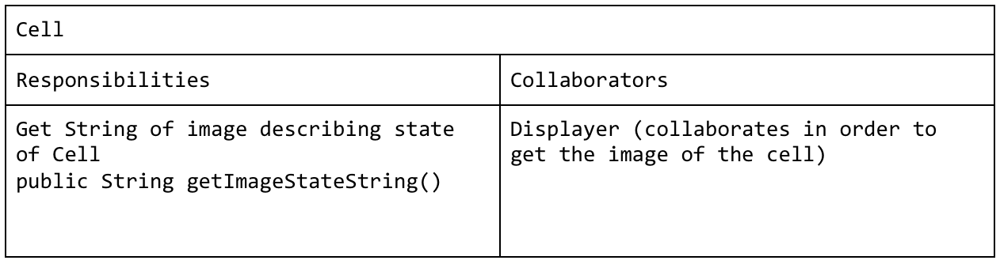
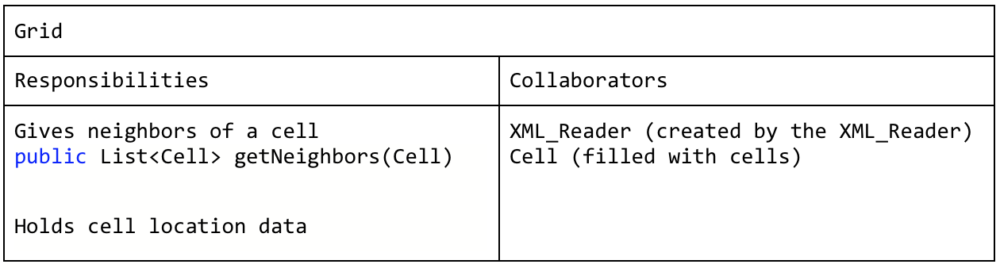
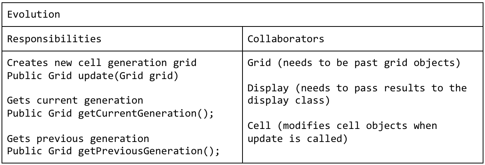
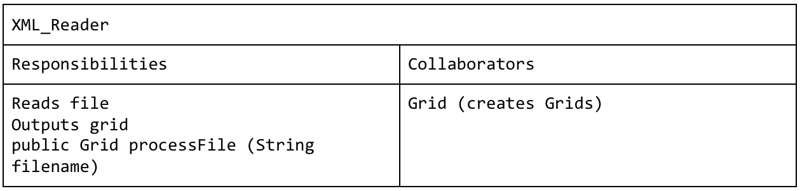
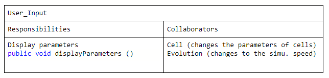
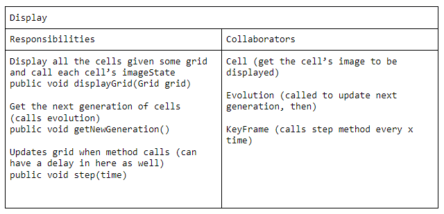

# Cell Society Design Plan
### Team Number 5
### Names
Robert Barnette

Kevin Yang

Felix Jiang


## Introduction
1. Problem: We are trying to make a JavaFX program that is able to model a variety of cellular automata
2. Design Goals: To accomplish this we want to read data from an XML configuation file and then process this into the initial parameters of a simululation. Then we would like to apply the ruleset of the game to update the cells described by the XML file to simulate a particular cellular automata. Finally we would like to visualize this simulation in a clear and appealing way. 
3. Primary Architecture: Elements of the game configuration should be open to the player to change, while specific game structures such as the creation of cells should be not alterable. 
  - Closed: Things like creating new "rules" for simulations should be closed from the user running the simulation. They should be able to select which type of simulation is running, but they will not have the ability to create new rules while the program is running

## Overview













* Different Implementations: the grid can be a List of List type, or an Array of Array, or a combination of the two (or map, set, etc.). Regardless, the grid is known to the outside as an object that holds all of the cells, and any internal implementation should not matter since the public grid methods should be applicable to all of them 

## User Interface
1. Select Simulation type
2. Title for our project and a menu
3. Error screens to display if a file was not found, or a default error screen if the program can’t detect what’s going wrong
The user should then be able to pause, stop, or switch simulations once the simulation screen is shown. 
Some interactable feature that alters simulation speed


## Configuration File Format
Example Files
```xml
<grid>
    <rows>100</rows>
    <cols>100</cols>
    <row1>00000010101010</row1>
    <row2>01010202020202</row2>
    ...
</grid>
```
```xml
    <GameType>Game of Life</GameType>
<!-- these will likely be a subclass of evolution, depending on the type of game --!>
```


## Design Details
1. Visualization: This will be done primarily inside the Display class which will get the current generation of cells from the evolution class and then update the display based on this. This class will be the same for different types of simulations but it will use different subclasses of the evolution class to get the next generation of cells which will be dependent on the type of simulation. 
2. Simulation: The grid class will hold a bunch of cells, and the cell states will be updated based on rules of a specific Evolution class implementation. Internal data structure of Grid will be able to detect where a cell is and how many neighbors it has. The simulation will not specify what the internal data structure of the grid is outside of the Grid class, and based on the specifications, will not import any JavaFX features, because another class in the visualization is responsible for displaying the grid’s information. 
  * The grid is responsible for holding a bunch of cells, but each cell can have its own implementation as well, so the Grid class will hold Cell objects, and other cell types may extend the main Cell class if we deem it necessary. Regardless, the Grid holds Cells, and does not know about the implementation of the Cell
3. Configuration: This will take in a file to determine the starting information for the cells, the game screen parameters, and the type of game that will be running. The XML reader class will process this configuration file and turn it into a Grid object. 


## Use Cases
1. Apply the rules to a middle cell: set the next state of a cell to dead by counting its number of neighbors using the Game of Life rules for a cell in the middle (i.e., with all its neighbors)
  * Evolution class or subclass would have the game of life rules, and for each Cell, calls the grid class to get its neighbor, and then updates accordingly. The evolution class will have some way of knowing what kind of cell it is based on the neighbors that are returned
2. Apply the rules to an edge cell: set the next state of a cell to live by counting its number of neighbors using the Game of Life rules for a cell on the edge (i.e., with some of its neighbors missing)
  * Same idea as 1 but the evolution subclass will call a different private method 
3. Move to the next generation: update all cells in a simulation from their current state to their next state and display the result graphically
  * Display will call evolution’s update and getCurrentGeneration methods and then display the results from getCurrentGeneration (either from returning another Grid, or having it as an instance variable)
4. Set a simulation parameter: set the value of a global configuration parameter, probCatch, for a simulation, Fire, based on the value given in an XML fire
  * The XML Reader class will first create the Fire simulation (a subclass of evolution presumably). Then it will use getters/setters for evolution or in the constructor itself to set the value of probCatch (which the XML reader will know this value based on Java’s parsing)
5. Switch simulations: load a new simulation from an XML file, stopping the current running simulation, Segregation, and starting the newly loaded simulation, Wa-Tor
  * The user selects another game or starting configuration from some list of options (like a dropdown menu).  The XML Reader takes that new game to read an XML file, which returns a grid that holds the new simulation
6. Increase simulation speed
  * User clicks increase speed or slides a slider to increase the speed. User_Input class reads in this signal, and passes this information onto Display in order to speed up or slow down the speed it displays the new cell states
7. The user wants Cells to be a shape other than squares
  * The Cell class is a bare bones model, so it would only be responsible for knowing which image string to return based on its state. The Grid class would have to be extended so basic methods are inherited, but a completely new implementation will be necessary, perhaps using a completely different data structure as well. However, the public methods of the extended Grid class should still have the same functionality. 
8. Add an additional simulation with new rules
  * A new extension of the evolution class should be created that implements the particular rules of the simulation. 
  * A new XML configuration file should also be generated as a starting point for the simulation. 
9. Change the window size and parameters from some user input or XML configuration file
  * Potentially create an options menu or add a new XML configuration file that may determine screen size, cell size, window color
10. User wants to change initial state
  * Write a new XML file with a different initial state
11. User wants to restart the simulation from the beginning 
  * Reload the XML file and begin the simulation again 


## Design Considerations
1. Display: 
  * How to turn the data stored inside the grid object into a graphical representation of it. For simpler cell types we discussed simply using black/white rectangles; however, for more complicated simulations images could be utilized for the cell. 
  * The display class is also responsible for determining how fast the simulation is, since its step() method will call evolution’s getNextGeneration method and then have some sort of delay (or this delay can be inputted directly into the KeyFrame duration. No other class really should have this responsibility, since the grid and cells don’t care how they are viewed, and the evolution’s job is to just get the next evolution, so we stuck with display having this job. However, it can be a bit confusing why the display class has some logic about how often it is updated, but that really should be part of displaying the cells. 
2. User Input:
  * How exactly to take in the users input is still being discussed. We talked about possibly using sliders to adjust the speed and buttons to switch between simulation however the full design is not fully fleshed out. 
3. What class handles updating each cell’s state:
  * We discussed many options, including letting each cell have their own Update method. Our current plan is for the evolution’s getNextGeneration update each cell, and it does this by calling Grid methods in order to get each cell’s neighbors and updating based on the Evolution class’s rules. This keeps our Cell class very simple and basic, and the part of getting neighbors can be a core feature that all subclasses of evolution have. Additionally, new evolution subclasses can have their own rule methods, and the grid class and cell class do not care about these rules, since they are just a model, while the Displayer only calls an Evolution object, not really interested in what subclass it is necessarily. 
4. XML file format:
  * XML elements to determine game parameters rather than attributes, which can be handled directly similar to variables.
  * XML elements can be named to directly express what configuration setting they represent.
5. Dependencies:
  * Cell is just a data object, can exist on its own
  * XML reader requires a configuration file to generate a significant result as well as the Grid class as it constructs the file into a grid object. 
  * Grid depends on the Cell class
  * Displayer depends on Evolution to create the next generation, before it can display that layout
6. Assumptions
  * The cell’s state is accurate so when the displayer reads its state, the displayed information is accurate
We assume that the data file fed to the XML reader is formatted in a way that it can be properly interpreted by this class 
The game visuals are likely decided before the game has started the simulation


## Team Responsibilities

 * Team Member #1
Robert Barnette: Work on implementing the simulation aspect of the project
 * Team Member #2
Felix Jiang: Work on implementing the visualization aspect of the project
 * Team Member #3
Kevin Yang: Work on implementing the XML and other configuration aspects of the project
