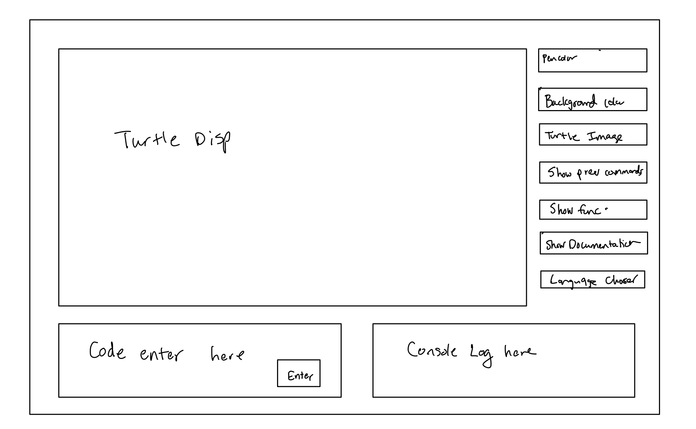

# SLogo Design Plan
### Team Number 02
### Names

Bill Guo (wg78)
Billy Luqiu (wyl6)
Tomas Esber (tee9)
Robert Barnette (rhb19)

## Introduction
The primary design goal of this project is to implement the Slogo language by providing an interactive display that takes in and executes user commands. The user input will take in a command string and pass this to the backend where it is then parsed and converted into a particular command. The command then updates the state of the turtle and the changes that are applied to the turtle are passed to the front end to display.

## Overview

### Backend External API
The backend external API allows for the front end to get various features regarding the current slogo.model state. The backend API should allow for the user to get information about the turtle such as the current location and state information such as if the turtle should be visible or if the pen is currently drawing anything or not. It will keep track of all these states regarding the turtle and return the current state when called. The backend will also keep track of all previous commands to be displayed for the front end. It will also contain be albe to return the variables created from previous commands to be displayed.

#### LineCoords: keeps track of the characteristics that define a line drawn by the turtle

Responsibilities: Knowing the start and endpoint of a line drawn by the turtle and giving that information to the view

Dependencies: None

```java
public LineCoords{
  public double getXStartPosition()
  public double getYStartPosition()
  public double getXEndPosition()
  public double getYEndPosition()
}
```

#### BackEndController: Responsible for communication between the front end and the back end by sending data to the front end when the slogo.model updates through command inputs

Responsibilities: Returning the list of previous commands, returning the list of current variables, sending turtle data about the scene, returning the needed information to print to console

Dependencies: Turtle, TurtleData, Command

```java
public BackEndController{
  public ImmutableList<String> getPreviousCommands()
  public ImmutableList<String> getCurrentVariables()
  public ImmutableList<String> getPreviousFunctionsDefined()
  public List<TurtleData> getTurtleData(List<Turtle> turtles)
  public String getAndResetConsoleData()
  public String throwError()
}
```

#### TurtleData: Data class that houses the information that should be drawn on the view. Each turtle has its own data to update and be able to send to the view through the controller without the view being able to know the turtle's implementation.

Responsibilities: Keeping track if the turtle is shown, its location and orientation, and any lines that are newly drawn

Dependencies: None

```java
public TurtleData {
  public boolean turtleDisplayed()
  public LineCoords getCurrentTurtleLocation()
  public double getOrientation()
  public List<LineCoords> pathToDraw()
}
```

### Frontend External API
The frontend external API will allow the users to pass in commands and then pass the inputted commands to the backend for execution.

#### FrontEndController: Can be called by the frontend to send the next command inputted in the ConsoleDisplay

Responsibilities: sending commands inputted in the console to be parsed by the backend

Dependencies: View, Parser

```java
public FrontEndController{
  public void getNextCommand(String command)
  public String getLanguage();
}
```

### Backend Internal API

The backend Internal API allows for the backend to communicate with each other regarding commands. For instance, the controller class would call the turtle to update the turtle based off the command, and the command class would have methods to return the state of the command (i.e. what the command should do). Each different type of command would require a different classes. Such classes will include commands that effect the turtle position, commands that just return a value, commands that are nested commands (for loops), and each type of command will have different attributes.

We will also have to create a command type that will take in a list of commands (such as for loop/ while loop/ repeat), and create a separate subclass from the main command class from that.

Another command type will be the one line commands such as turtle queries, and math operations, which will be a separate command.

We will have a separate class for each type of command, such as math commands, boolean commands, and turtle commands.

#### Model: Object that keeps track of all turtles and variables created

Responsibilities: Receiving commands from the parser and updating them to the turtle, updating variables

Dependencies: Turtle, Command

public Model {
protected void storeVariable(Pair<String, String> variable)
protected void storeUserDefinedCommand(Pair<String, String> userCommand)
protected void storeCommand(String command)
protected void executeCommand(Command command)
}

#### Turtle: Object that keeps track of the turtle's state and lines that it drew

Responsibilities: Keeps track of the turtles position, rotation, and path

Dependencies: TurtleData

```java
public Turtle {

  protected List<LineCoords> getDrawnLines()

  protected double getXPosition()
  protected double getYPosition()
  protected void setPosition(double xDelta, double yDelta)
  protected double getDirection()
  protected void setDirection(double degrees)
  protected void setDrawn(boolean drawn)
}
```

#### Command: Generic command class that handles the execution of a single line of code.

Responsibilities: Handles the process of creating and executing smaller instruction objects that individually can update the turtledata or print to console

Dependencies: Instruction, Turtle

```java
public abstract Command{
  protected String getCommandAsString()
  protected String executeCommand(Turtle turtle)
}
```

#### Instruction: Represents simple instructions like "fd 50"

Responsibilities: Handles the execution of a single command and its effect on the turtle

Dependencies: Turtle

public abstract Instruction{
protected int executeInstruction(Turtle turtle)

}

#### Parser: Object that parses the string inputs into a list of commands

Responsibilities: Takes a given string input and turns it into a list of commands that can then be executed by the controller

Dependencies: Command, Instruction

```java
public Parser{
  public Command parseCommand(String command)

  public void setLanguage();
}

```
### Frontend Internal API

The frontend internal API should be able to return/set the current language of the program, as well as the attributes regarding the GUI such as colors/turtle image, and background image. It should be able to get the current input from the userinput class.

#### Display: Main display that houses all the UI elements of the program

Responsibilities: Update all the components of the individual display that need to be updateTurtleDisplay

Dependencies: FrontEndController, BackEndController, ConsoleDisplay, TurtleDisplay, VariableDisplay, DisplayAttributes

```java
public Display{
  protected void updateAllViews(List<TurtleData> turtles, String command, String consoleOutput)
}
```

#### TurtleDisplay: Keeps track of the turtle's position and any lines that it drew

Responsibilities: Updating visual characteristics of the turtle

Dependencies: None

```java
public TurtleDisplay{
  protected void updateTurtleDisplay()
  protected void setLineColor(Color color)
  protected void setBackgroundColor(Color color)
  protected void setTurtleColor(Color color)
  public GridPane getGridPane()

  protected void getImageOfTurtle()
}
```

#### VariableDisplay: Handles the display of created variables

Responsibilities: Displaying variables

Dependencies: None

```java
public VariableDisplay {
  protected void showVariablesDefined(Map<String, String> variables)
}
```

#### ConsoleDisplay: Handles the display of error messages, previous commands, and defined commands

Responsibilities: Displaying error messages, previous commands, defined commands

Dependencies: None

```java
public ConsoleDisplay {
  protected String getConsoleText()
  protected void updateCommandHistory(String command)
  protected void printError(String errorMessage)
  protected void showPreviousCommmands(List<String> commands)
  protected void showPreviousFunctionsDefined((Map<String, String> functions)
}
```

#### DisplayAttributes: Stores information about the view

Responsibilities: Setting language, turtle image, pen color

Dependencies: Display

```java
public DisplayAttributes{
  protected void setPenColor(Color color)
  protected void setImageOfTurtle(Image image)
  protected void setLanguage(String language)
  
}
```

#### Two different implementations
Implementation of repeat commands. The repeat command class will include an instance variable representing the command that is going to repeat and the number of times it will repeat, and the parser will call the constructor that will set the instance variables accordingly. For commands like a while object, a stop condition will also be specified. This type of command will just call other commands until it is finished executing. Another option we considered was simply parsing the repeat command into a list of instructions, but determined that this would not scale well to structures such as loops, particularly while loops which rely on a condition to end.

We decided on different classes for instructions, commands, and super commands (like for loops). Commands include a stack of instructions that are processed acording to LIFO principles so that each command has the parameters it needs to be run. Super commands include a list of both normal commands and super commands and such lists are run sequentially.

## User Interface
The user interface will include a display of the turtle and any lines that it has drawn. Additionally, there will be two text boxes, one to enter commmands along with an enter key, and another text box that displays the console log of error messages along with other messages. There will be drop down menus to help select the color of the pen and other attributes, along with buttons to show previous commands, variable states, defined functions, and course rules.



## Design Details
Backend External: The goal of the backend API was so that it only returned the things and attributes that the front end needed to know. The API supports this by keeping most of the data inside two classes, the controller class that represents attributes such as console data, and turtleData class that has the current attributes of the turtle that the front end needs to know. Thus, the API supports this by keeping the method calls into those two classes, as well as a helper class that is able to describe lines in an efficient manner. In order to extend the backend external to additional features, more API methods would have to be implemented in the controller class to get attributes relating to the features, and the data it would have to get from the backend.

Frontend Internal: This API will have a primary display class that displays data from other specific classes. For instance there will be a class managing the display of the turtle, a class managing the display of the console, and a class managing the display of the user input features. The primary display manages these three classes creating a complete display for the user to interact with.

Frontend External: This API is relatively simple as the only thing it does is pass the current value of the user input to the controller class which then parses it and turns it into a command object.


Backend Internal: The Backend Internal API allows for the backend to communicate with each other regarding commands. Classes will include commands that affect the turtle position, commands that just return a value, commands that are nested commands (for loops), and each type of command will have different attributes. Making the Command class abstract will allow us to extend implementation by adding more commands in a relatively straightforward manner. This is the same case with the abstract Instruction class.

## Test Plan
We utilized a variety of different command classes that each have a very specific role. The parser also will detect for improperly formatted commands and provide and error message in this case.

#### Feature: Math
* 1+1 should output 2
* 1/0 should throw a divide by 0 error
* Random 5 should return a random number less than 5.
#### Feature: Boolean Expression
* Asserting AND TRUE NULL should thrown an exception
* Asserting AND TRUE FALSE should return 0
* Asserting LESS 2 5 should return 1


## Design Considerations
One issue we discussed at length was the implementation for the Parser class. We discussed several options including using Maps, Reflection, or Enums. The specifics of this class would affect how we structure methods in our Back-End. Using Maps would mean creating a HashMap that mapped a String to a Command Object that would represent our specific Command. It's a simple implementation which is definitely a pro, but it would potentially involve unwanted switch statements that we don't necessarily want to have. Using Reflection would certainly alleviate this problem but it is an API that we don't exactly know how to use and so actually implementing could be a messy and potentially tedious process.

## Team Responsibilities

* Tomas Esber - Work on the Parser

* Bill Guo - front end primarily

* Billy Luqiu - front end primarily, but float to back end if front end is finished

* Robert Barnette: Work on the turtle, controller, instruction and command classes


## Use Cases
See usecases folder 